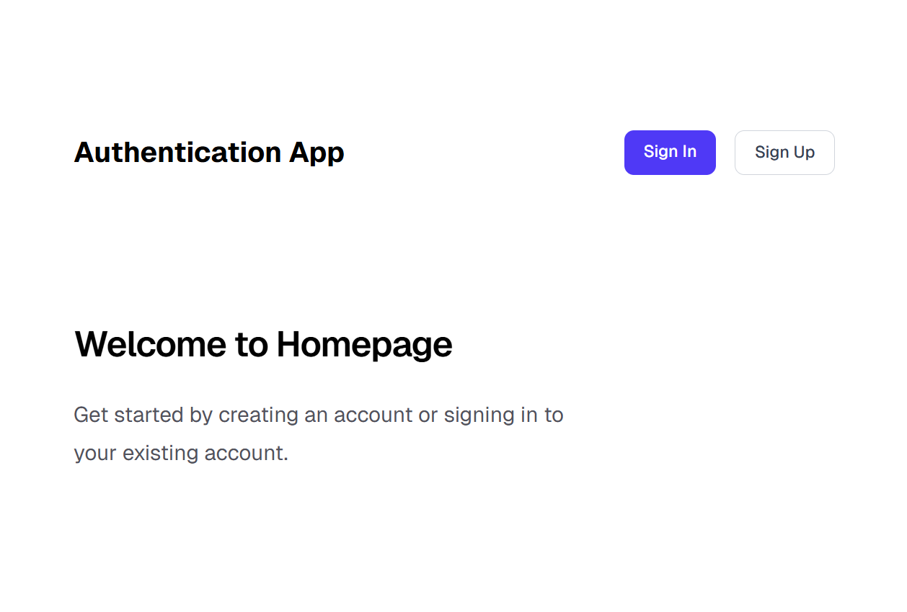
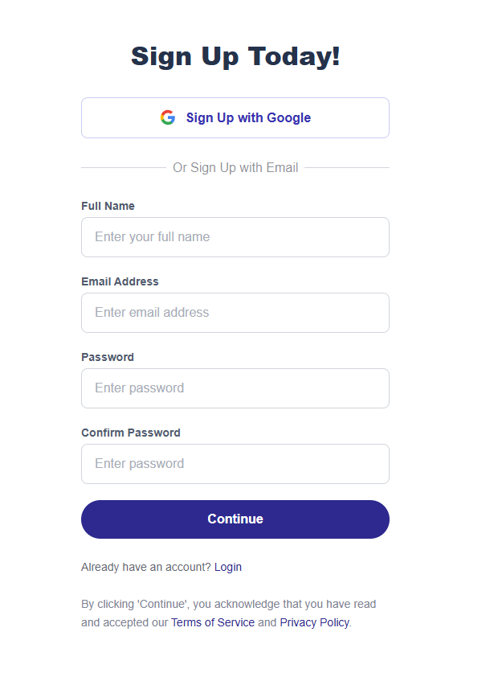
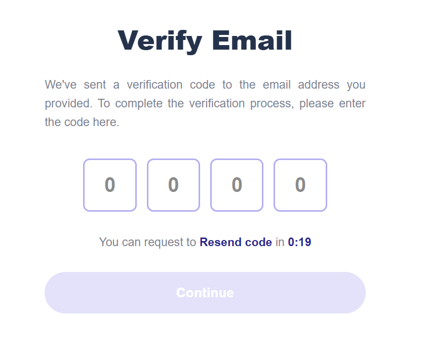
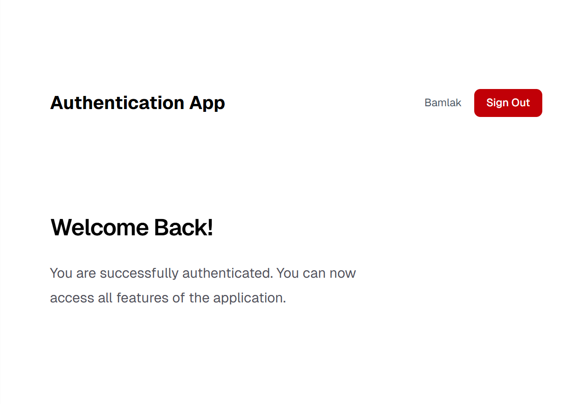

# Next Auth App

A simple auth experience built with Next.js, TypeScript, and NextAuth. Users can sign up with role selection, verify their email via OTP, and sign in securely with client-side validation and token handling.

## Screenshots
- Home: landing state showing logged-in user info and sign-out control.  

- Signup: role-aware registration form with name, email, password, and confirm password plus validation messaging.  

- Sign In: email/password authentication form with client-side validation and token-driven sign-in.  

- Verify Email: OTP entry screen tied to the `/verify-email` flow for confirming a new account.  

- Success State: confirmation view after successful OTP verification completing signup.  

## Run

1. Clone or download this repository.
2. Install dependencies: `npm install`
3. Start the development server: `npm run dev`
4. Visit `http://localhost:3000` in your browser.